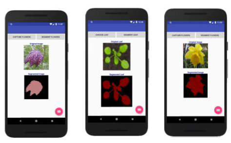

# Towards In-Field Live Phenotyping for Low-Cost Plant Phenotyping.
We explore how to compress existing very deep CNNs for plant traits segmentation. Thus making them easily deployable in-field and on mobile devices. In particular, we focused on applying these models to the pixel-wise segmentation of plants into multiple classes including the background, a challenging problem in the plant phenotyping community. We combined two approaches (Separable Convolutions and SVD) to reduce model parameters and weight matrices of these very deep CNN-based models. Using our combined method (Separable Convolution and SVD) reduced the weight matrix by up to 95% without affecting pixel-wise accuracy.

# Minimum dependencies required to use these codes:
Python 3.6.1

Keras 2.0.6

Tensorflow 1.3.0

Numpy 1.13.3

Pillow 5.1.0

Opencv 3.2.0

# Running the codes:
Use train.py to train the baseline models and train_lite.py can be used to train the "Lite" models

Use evaluate.py to evaluate the baseline models and evaluate_lite.py to evaluate the "Lite" models.

Most network parameters can be changed in the parameter file.

All CNN models are contained in the Models folder

# Datasets are not included but can be downloaded from:

Flower Dataset: http://www.robots.ox.ac.uk/~vgg/data/flowers/17/index.html

Plant Dataset: https://www.plant-phenotyping.org/datasets-home

CamVid Dataset: http://mi.eng.cam.ac.uk/research/projects/VideoRec/CamVid/
